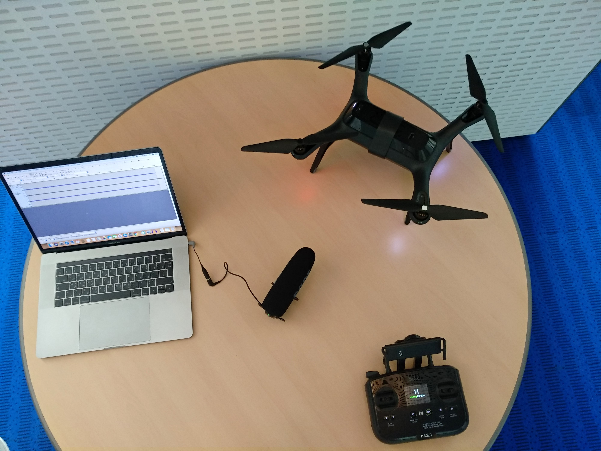

# Drone-Payload

This page contains recordings of 3DR SOLO drone sound while carrying different payloads from 0 - 500 grams, with 50 g step. Those recordings analysis will be publish in the paper "Noise2Weight: On Detecting Payload Weight from Drones Acoustic Emissions" by Omar Adel Ibrahim, Savio Sciancalepore, and Roberto Di Pietro.

### Equipment

Equipment used for collecting the recordings:

Drone: 3DR SOLO drone.\
Microphone: Rode VideoMic Pro directional microphone.\
Laptop: MacBook Pro laptop, equipped with a 2.9 GHz Intel Core i7 processor and 16 GB of RAM.

### Recordings description:

We used the Audacity audio software at sampling rate of 44.1 KHz.

The drone sound recordings were collected in an open, outdoor environment, placing the microphone at a distance of 7 meters from the hovering drone. For each measurement, lasting 170 seconds, the payload that the drone was carrying was changed. We experimented with a total of 11 different payload weights, from 0 g to 500 g, with steps of 50 g. We remark that each recording starts at the time the drone is hovering, and it ends before the drone lands, to capture only the sound of the drone hovering in place.

### License

Drone-Payload Recordings are released under the BSD 3-Clause [license](LISCENSE.md).
